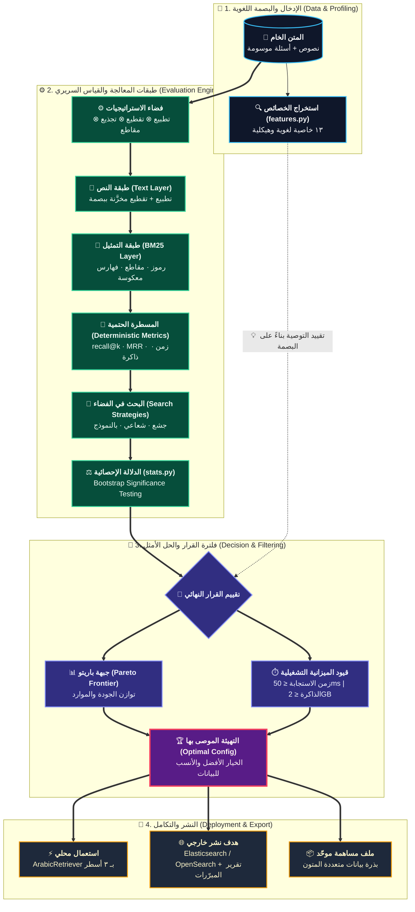

# التصميم

`README` يشرح **ما يفعله** المشروع. هذي الوثيقة تشرح **لماذا بُني هكذا** — والقرارات التي رُفضت،
لأن البدائل المرفوضة تشرح التصميم أكثر مما تشرحه المختارة.

## المبدأ الحاكم

> **لا تُصدَر توصية لا يمكن تبريرها ولا تحديد حدود صلاحيتها.**

كل قرار تصميمي أدناه مشتقٌّ من هذا المبدأ، لا من تفضيل هندسي.

---

## التدفّق

**لاحظ أن خصائص المتن تدخل عند طرفَي المسار:** في البداية لتوصيف ما نقيسه، وفي النهاية
لتقييد ما نوصي به. **هذا هو ما يمنع التوصية من أن تُقتطع من سياقها.**

---

## حدود الطبقات — ولماذا كلٌّ منها

### النص ↔ التمثيل

**الحد:** `Strategy.text_layer_key()` تتضمّن التطبيع والتقطيع، **ولا تتضمّن `ngram`**.

**السبب:** التطبيع والتقطيع مكلفان ومدمِّران (لا رجعة فيهما)؛ والتمثيل رخيص وقابل للإعادة.
فتغيير `ngram` يُعيد استخدام طبقة نصٍّ مخزَّنة بدل بنائها.

**الأثر الملموس:** البحث يُنتج دائمًا مرشّحًا يغيّر التمثيل وحده — فحصٌ رخيص لأثر `ngram`
منفردًا. **الحد المعماري صار استراتيجية بحث.**

### المسطرة ↔ كل ما عداها

**الحد:** المسطرة **حتمية بالكامل** — بلا نموذج، وبلا عشوائية، ونفس المدخل يعطي نفس المخرج.

**السبب:** الحلقة تتعلّم من فروق الدرجات. ومسطرةٌ مطاطية تجعل الفرق بين «تحسّنت الاستراتيجية»
و«تغيّر مزاج النموذج» غير قابل للتمييز — **فتنقطع إشارة التعلّم من أصلها**.

هذا الحدّ هو **الشرط** الذي يجعل الطبقة الذكية فوقه ممكنة، لا نقيضها.

### القياس ↔ القرار

**الحد:** `evaluate()` تُخرج أرقامًا ولا تقول «الأفضل». الترتيب يقع في `pareto.py` بمعايير
يحددها المستخدم.

**السبب:** «الأفضل» يعتمد على مقايضة بين دقة وزمن وذاكرة، وهذي المقايضة **تخصّ الاستخدام لا الأداة**.

### القلب ↔ محرك الإنتاج

**الحد:** Elasticsearch **هدف نشر**، لا اعتمادية ولا جزء من القلب (`deploy.py` معزول تمامًا).

**السبب:** الأداة لا تصلح لمليون مستند — قِيس ذلك (٦٣ كيلوبايت/مستند، واستعلام `n^1.15`).
**لكن المعرفة تنتقل حتى لا ينتقل الكود.**

---

## العقود بين المكوّنات

| المكوّن | يدخل | يخرج |
|---|---|---|
| `features.extract` | `[{id, text}]` | ١٣ خاصية + مقارنة بالمرجع |
| `core.build_text_layer` | متن + استراتيجية | مقاطع نصّية + مالكوها (مخزَّنة) |
| `core.evaluate` | متن + أسئلة + استراتيجية | `recall@k`, `mrr`, **نتيجة لكل سؤال** |
| `stats.paired_bootstrap` | نتيجتان لكل سؤال | فارق + مجال ثقة + حكم |
| `pareto.frontier` | نقاط (دقة، زمن، ذاكرة) | غير المُهيمَن عليها |
| `deploy.export` | تهيئة + دليل | إعدادات محرك + تقرير مبرّرات |
| `contribute` | متن + أسئلة | ملف `arl-contribution/1` |

**العقد الأهم: `evaluate` تُخرج نتيجة لكل سؤال لا متوسطًا.** بلا هذا يستحيل الاختبار المزدوج،
وبلا الاختبار المزدوج يصير كل فرق منشور ادّعاءً.

---

## قرارات رُفضت — ولماذا

**دالة منفعة `Recall / Latency / Memory`.** قسمة كميات بوحدات مختلفة تُنتج رقمًا **يتغيّر
ترتيبه بتغيّر الوحدات** (ميلي ثانية أم ثانية؟). ليست مشكلة برمجية بل رياضية.
البديل: جبهة باريتو + قيد ميزانية.

**نموذج لغوي داخل المسطرة.** يكسر الحتمية، فيمنع التعلّم (انظر أعلاه).

**التحسين البايزي.** يحتاج مكتبة ثقيلة، ومكسبه فوق الشعاعي هامشي في فضاء بهذا الحجم.

**NumPy لتسريع BM25.** يكسر «صفر اعتماديات» — وهي خاصية تبنٍّ لا رفاهية. إن لزم، فكإضافة اختيارية.

**البحث الشعاعي افتراضيًا.** نُفِّذ، وقِيس: **بلغ نفس الأمثل بضعف الكلفة** على متننا. فبقي
الجشع افتراضيًا، والشعاعي خيارًا موثّقًا لمن يشك في تفاعل القرارات. **القرار من القياس لا من النظرية.**

**نموذج تنبّئي (خصائص ← تهيئة).** بياناتنا متن واحد من نوع نصّي واحد؛ أي نموذج عليها يُلائم
ضجيجًا ويُصدر توصيات واثقة خاطئة — أي ينقض المبدأ الحاكم. البروتوكول أولًا، ثم النموذج.

---

## ثوابت يحرسها الاختبار

| الثابت | الاختبار |
|---|---|
| المسطرة لا ترتجف بين تشغيلتين | `test_metric_bounds_and_reproducibility` |
| `ngram` لا يُبطل طبقة النص | `test_text_layer_is_independent_of_representation` |
| التطبيع اختياري بالكامل، ولا شيء افتراضي | `test_normalization_is_optional_and_ordered` |
| التقطيع لا يُخرج شظايا | `test_discourse_chunking_does_not_emit_tiny_fragments` |
| المُهيمَن عليه يُستبعد، والمقايضة تبقى | `test_pareto_*` |
| الاختبار المزدوج يميّز الحقيقي من الضجيج | `test_paired_bootstrap_*` |
| تقرير النشر يحمل تحذير التوسّع | `test_deploy_rationale_warns_about_ngram_at_scale` |

**كل ثابتٍ هنا وُضع بعد خطأ وقع فعلًا**، لا احتياطًا نظريًا.

التغطية الإجمالية **٨٩٪**، والنواة `core.py` **٩٩٪**. وما بقي غير مغطّى متعمَّد:
مسارات استدعاء الشبكة في `llm.py` (تحتاج محاكاة مزوّد)، ومسارات الاقتراح بالنموذج
في `agents.py`. **والمسار الافتراضي — الاستكشافي بلا نموذج — مغطّى بالكامل.**

---

## نقاط التوسعة

**عملية تطبيع جديدة:** أضفها إلى `ALL_NORM_OPS` وإلى `normalize()`. تدخل تلقائيًا في
فضاء البحث وتحليل المساهمة.

**هدف نشر جديد:** أضف اسمه إلى `deploy.TARGETS` وترجمة مرشّحاته في `_filters()`.

**مسجِّل بديل (دلالي مثلًا):** استبدل `BM25` داخل `evaluate()`؛ الواجهة المطلوبة
`scores(query_tokens) -> {doc_index: score}` — والباقي يعمل بلا تعديل.

**خاصية متن جديدة:** أضفها إلى `CorpusFeatures` و`extract()`. (خصائص مشتقة أعمق — تنوّع
الصيغ الصرفية، وتوزيع أطوال الوثائق بدل المتوسط — **مؤجَّلة عمدًا** حتى تتوفر متون متعددة
تجعل قياس أثرها ممكنًا.)

---

## ما ليس في التصميم عمدًا

لا خادم، ولا حالة دائمة، ولا واجهة رسومية، ولا تزامن، ولا توزيع. **الأداة تعمل مرة وتُخرج قرارًا
وتنتهي.** وكل ما يتجاوز ذلك مكانه محرك الإنتاج — وإليه يُصدَّر القرار.
