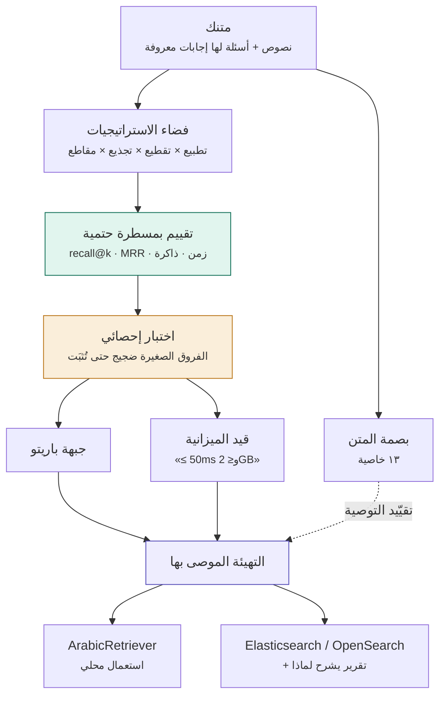

<div align="center">

# Arabic Retrieval Lab
### مختبر الاسترجاع العربي · «علم نافع»

**إعداد وتطوير: المهندس عبدالرحمن رفاعي المطيري (Eng. Abdulrahman Refai Al-Mutairi)**

**لا توجد «أفضل إعدادات» للبحث في النص العربي — توجد أفضل إعدادات لمتنك أنت. وهذي أداة تقيسها.**

[](LICENSE)
[](pyproject.toml)
[](pyproject.toml)
[](tests/test_core.py)

</div>

---

> **This project does not seek to confirm a hypothesis — it seeks to refute one when the data does not support it.** It has publicly corrected itself three times so far.

---

<details open>
<summary><b>English summary</b> — 30 seconds</summary>

A dependency-free measurement lab that finds the best **lexical retrieval configuration**
(normalization · chunking · light stemming · character n-grams) **for your Arabic corpus**,
then exports that decision to Elasticsearch/OpenSearch.

Measured on **27,718 Arabic news articles** with evaluation-leakage control:

- A benchmark without leakage control **inflates recall 6×** (0.687 → 0.117).
- **Light stemming beats character n-grams** (0.305 vs 0.245) — and their combination beats both (0.357).
- The winning configuration is **a function of corpus size**: the n-gram gain vanishes above ~10k documents.
- Lexical retrieval alone is not enough for Arabic: at 8,000 docs, **more than half the questions fail even at k=20**.

Every number has a confidence interval; every comparison has a paired bootstrap test;
every claim states the corpus it came from. `pytest` · zero dependencies · MIT.

</details>

---

## المشكلة

عندك نصوص عربية وتريد البحث فيها. قبل أي بحث لازم تقرر: أوحّد الهمزات؟ أحذف التشكيل؟ أجذّع الكلمات؟ أقطّع كل ٢٠٠ حرف أم عند نهايات الجُمل؟ أضيف مقاطع حرفية؟

**كل مطوّر عربي يختار هذي القرارات بالحدس، والفرق بينها ضخم:** على متننا، أسوأ تهيئة تعطي `0.030` وأفضلها `0.177` — **ستة أضعاف**، بنفس البيانات ونفس المحرك.

هذي الأداة تقيسها لك، وتخبرك **كم يضيف كل قرار على حدة**، وبأي كلفة زمن وذاكرة.

## كيف تعمل



## البدء السريع

```bash
git clone https://github.com/gomoodh-droid/arabic-retrieval.git && cd arabic-retrieval
pip install -e .                                   # بلا اعتماديات
pytest -q                                          # ٤١ اختبارًا · تغطية ٨٩٪
python run.py                                      # المختبر يعمل أمامك
python tune.py my_docs.json --questions my_qs.json # اضبطه على بياناتك
```

## مثال حقيقي

```python
from arl import ArabicRetriever

r = ArabicRetriever()          # الإعدادات الموصى بها — مقيسة لا مخمّنة
r.add([
    {"id": "d1", "text": "ارتفعت قدرة إنتاج المياه المحلاة في المملكة خلال عشر سنوات."},
    {"id": "d2", "text": "يخفض ترسب الغبار إنتاج الألواح الشمسية في المناطق الصحراوية."},
])
r.search("وش وضع المياه المحلاه؟", k=1)
```

```python
[{'id': 'd1', 'score': 3.1348, 'chunk': 'ارتفعت قدره انتاج المياه المحلاه ...'}]
```

لاحظ: السؤال بالعامية وبإملاء مختلف (`المحلاه` بدل `المحلاة`) — ومع ذلك أصاب.

**واضبطه على متنك:**

```bash
$ python tune.py my_docs.json --questions my_qs.json -k 1

البداية: 0.084
الجولة 0: +stem_light            +0.3466  →  0.4933
الجولة 1: ngram=3                +0.0734  →  0.5667
الجولة 2: حجم=450                +0.0600  →  0.6267
مسار الوصول على متنك: +stem_light ثم ngram=3 ثم حجم=450
أفضل تهيئة (84 تقييمًا): score=0.64 → best_config.json
```

## من أين جاءت التوصيات؟

ليست مأخوذة من ورقة ولا من عُرف. **قِيست هنا**، وهذي الطريقة كاملة:

| المفهوم | التفاصيل |
|---|---|
| **المتن** | ٢٧٬٧١٨ مقالًا صحفيًا عربيًا (٥٢٫٦ مليون حرف) — [SaudiNewsNet](https://github.com/ParallelMazen/SaudiNewsNet) |
| **الأسئلة** | العنوان كسؤال (العنوان استعلام، والمقال جوابه) |
| **ضبط التسريب** | كلمات العنوان **محذوفة** من نص المقال — بدونها يتضخم الرقم ستة أضعاف |
| **المقياس** | `recall@k` و`MRR`، بمسطرة حتمية لا ترتجف بين تشغيلتين |
| **الدلالة** | مجال ثقة لكل رقم، واختبار مزدوج بإعادة العيّنة لكل مقارنة |
| **إعادة الإنتاج** | [DATA.md](DATA.md) فيه أوامر التنزيل والتشغيل كاملة |

**النصوص غير موزّعة مع المستودع** (رخصتها CC BY-NC-SA) — يُشحن خط الأنابيب لا المحتوى.

## أهم النتائج

**١. اجمع بين التجذيع الخفيف والمقاطع الحرفية — لا تختر أحدهما.** التجذيع وحده `0.305`، والمقاطع وحدها `0.245`، **واجتماعهما `0.357`** (فروق مثبتة إحصائيًا).

**٢. التوصية دالةٌ في حجم المتن.** أفضلية التجذيع على المقاطع تنمو مع الحجم:

| المتن | 500 | 1,000 | 2,000 | 4,000 | 8,000 | 16,000 |
|---|---|---|---|---|---|---|
| النسبة | ×1.09 | ×1.15 | ×1.38 | ×1.63 | ×1.88 | ×2.50 |

`≈ 0.391·ln(n) − 1.501` بـ R²=0.916. **ونسمّيه اتجاهًا مقيسًا لا قانونًا** — ست نقاط من متن واحد.

**٣. فوق عشرة آلاف مستند، أسقط المقاطع الحرفية وقِس.** فائدتها تتلاشى (`+0.052` عند ١٥٠٠، و`+0.000` عند ١٦٠٠٠) ومقابلها ضعف الذاكرة.

**٤. الاسترجاع اللفظي وحده لا يكفي للعربية.** عند ٨٠٠٠ مستند وبعشرين نتيجة، **أكثر من نصف الأسئلة لا يصل جوابها**. لمن يبني RAG: نصف أسئلتك لن تبلغ النموذج مهما كان ذكيًا.

**٥. لا تنشر فرقًا بلا اختبار.** الفرق بين `0.245` و`0.2225` على ٤٠٠ سؤال تسعة أسئلة — قد يكون ضجيجًا.

📄 التفصيل الكامل والجداول: **[RESULTS.md](RESULTS.md)**

## متى تستخدمها ومتى لا

| خيار الاستخدام | التوجيه المعماري |
|---|---|
| **استخدمها** | تريد معرفة الإعدادات المناسبة **لمتنك**؛ متن صغير أو متوسط (حتى ~٥٠ ألف مستند)؛ لا تريد خادمًا ولا اعتماديات؛ تريد أرقامًا قابلة لإعادة الإنتاج |
| **لا تستخدمها** | ملايين المستندات (استخدم Elasticsearch — **وصدّر إليه قرار هذي الأداة**)؛ تحتاج استرجاعًا دلاليًا اليوم؛ تحتاج توزيعًا وتوافرًا عاليًا |

```bash
python -m arl.deploy best_config.json --target elasticsearch
# → deploy_elasticsearch.json   إعدادات محلّل جاهزة
# → deploy_rationale.md         لماذا هذي الإعدادات، وعلى أي متن، وبأي قيود
```

## الحدود

- **نوع نصّي واحد:** صحف بالفصحى. لا فتاوى ولا عقود ولا نصوص تقنية ولا تراثية مشكَّلة.
- **لهجة واحدة:** الأسئلة نجدية/خليجية بقلم شخص واحد — تحيّز معروف.
- **العنوان ليس سؤالًا حقيقيًا** حتى بعد ضبط التسريب؛ الأسئلة الواقعية أصعب، فأرقامنا **متفائلة على الأرجح**.
- **استرجاع لفظي فقط** — بلا تمثيل دلالي. وهذا سقفٌ مقيس لا رأي.
- **السقف العملي ~٥٠ ألف مستند:** ٦٣ كيلوبايت ذاكرة لكل مستند، وزمن الاستعلام ينمو `n^1.15`.
- **ست نقاط من متن واحد لا تُنشئ قانونًا** — ما نسمّيه «اتجاهًا مقيسًا» يبقى كذلك حتى تتعدد المتون.
- **لم تُقارَن** بأطر جاهزة (LightRAG، LlamaIndex) ولا بنماذج تمثيل (BGE-M3، ColBERT).

## الوثائق

| الملف | الوصف |
|---|---|
| [DESIGN.md](DESIGN.md) | المعمار، وحدود الطبقات، والقرارات التي **رُفضت** ولماذا |
| [RESULTS.md](RESULTS.md) | كل الجداول والتصحيحات المنشورة |
| [DATA.md](DATA.md) | كيف تستورد مقالات حقيقية وتعيد إنتاج الأرقام |
| [CONTRIBUTING_DATA.md](CONTRIBUTING_DATA.md) | بروتوكول المساهمة بالقياسات |
| [ROADMAP.md](ROADMAP.md) | ما لم يُنجَز، **ولماذا أُجّل** |
| [CHANGELOG.md](CHANGELOG.md) | سجل التغييرات |

## البنية

```text
arl/retriever.py  الواجهة العملية: ArabicRetriever
arl/core.py       الطبقات الثلاث + المسطرة الحتمية
arl/stats.py      مجالات الثقة والاختبار المزدوج
arl/pareto.py     جبهة باريتو وقيود الميزانية
arl/features.py   بصمة المتن (١٣ خاصية)
arl/profile.py    كلفة التشغيل
arl/deploy.py     التصدير إلى محركات الإنتاج + تقرير المبرّرات
tune.py · ablate.py · compare.py · scale.py · ingest.py · contribute.py
```

## المساهمة

أنفع مساهمة: **قياسات على متن من نوع مختلف** — انظر [CONTRIBUTING.md](CONTRIBUTING.md) و[CONTRIBUTING_DATA.md](CONTRIBUTING_DATA.md). القاعدة الوحيدة: **لا يُقبل ادّعاء بلا قياس.**

## شكر

الأفكار المعمارية مكيَّفة عن المجتمعين الصيني والكوري، منسوبةً لأصحابها في [DESIGN.md](DESIGN.md) و[RESULTS.md](RESULTS.md). وشكرٌ لمراجعٍ فضّل عدم ذكر اسمه — ملاحظاته أنتجت الاختبار الإحصائي، ومقارنة التجذيع التي **قلبت نتيجةً كنّا نشرناها**.

## الترخيص والاستشهاد

MIT — انظر [LICENSE](LICENSE). وللاستشهاد: [CITATION.cff](CITATION.cff).
